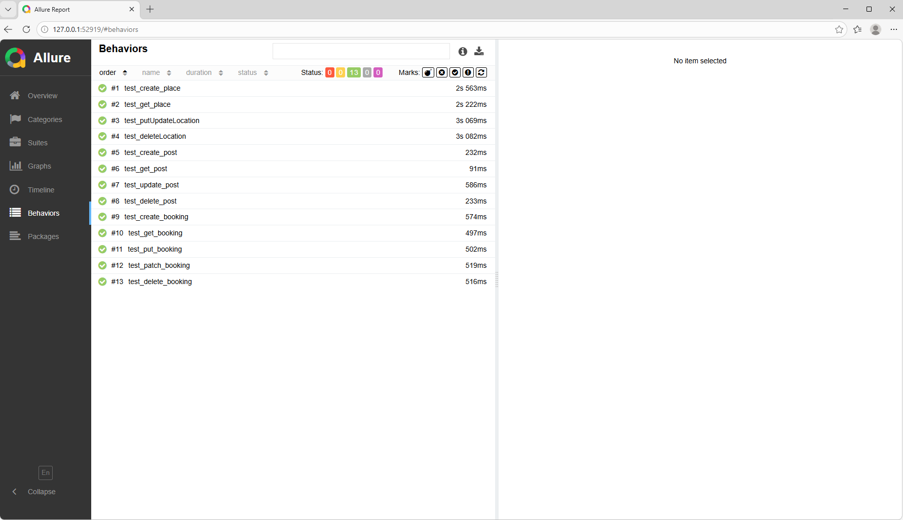
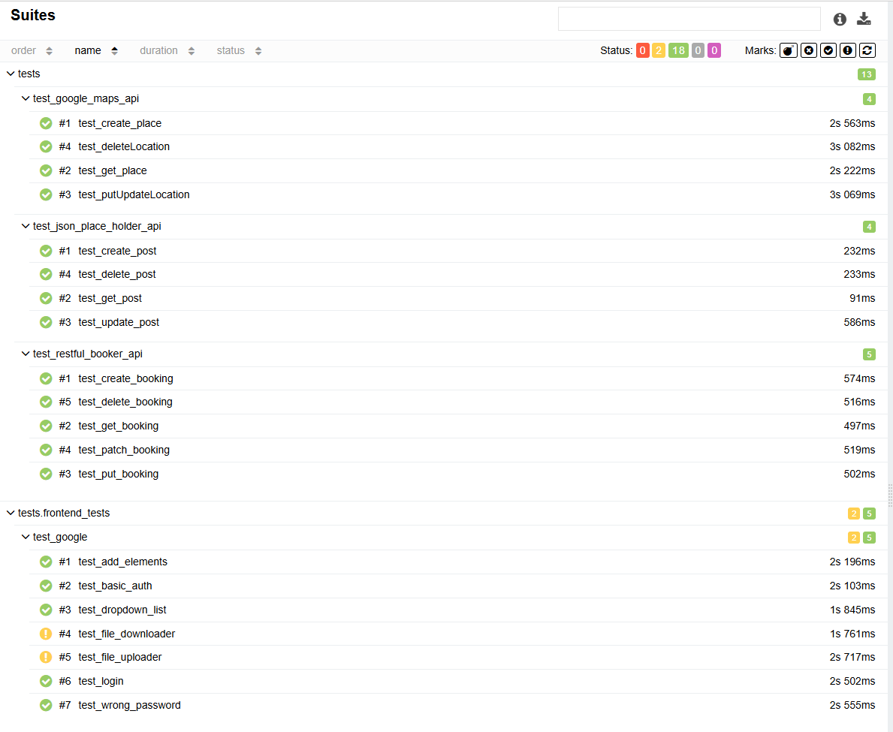
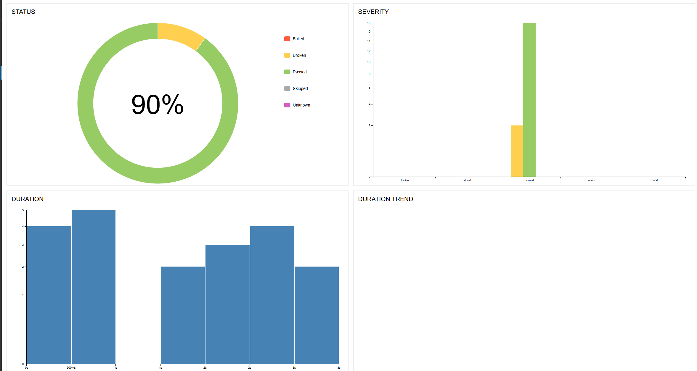

# API & UI Testing Pet Project

Проект содержит **автоматизированные тесты для API и Web UI**, реализованные с использованием **Pytest**.

Проект демонстрирует навыки:

* API тестирования
* UI тестирования
* работы с фикстурами
* работы с тестовыми данными
* организации тестового проекта
* генерации отчетов

---

# Тестируемые сервисы

API:

* https://restful-booker.herokuapp.com
* https://jsonplaceholder.typicode.com
* https://rahulshettyacademy.com

UI:

* https://the-internet.herokuapp.com

---

# Используемые технологии

* Python
* Pytest
* Requests
* Selenium WebDriver
* Postman
* Allure Report

---

# Функциональность автотестов

## API тестирование

Реализованы проверки:

* создание бронирования
* получение данных
* обновление бронирования
* удаление бронирования
* авторизация через токен

Используются фикстуры:

* `token` — получение токена авторизации
* `booking_id` — создание тестового бронирования

---

## UI тестирование

UI тесты написаны с использованием **Selenium WebDriver**.

Покрытые сценарии:

### Add / Remove Elements

Проверяется:

* добавление элементов
* удаление элементов
* корректное количество кнопок после операций

### Basic Auth

Проверяется:

* авторизация через Basic Auth
* успешный доступ к защищённой странице

### Dropdown

Проверяется:

* открытие выпадающего списка
* выбор элемента

### File Download

Проверяется:

* скачивание файла
* появление нового файла в директории `downloads`

### File Upload

Проверяется:

* загрузка файла через input type="file"

### Login

Проверяется:

* успешная авторизация пользователя

### Negative Login Test

Проверяется:

* ошибка при неверном пароле

---

# Структура проекта

```
project/

tests/
│
├── api_tests/
│   └── API автотесты
│
├── frontend_tests/
│   └── UI автотесты Selenium
│
cases/
│   └── тестовая документация
│
downloads/
│   └── файлы для тестов загрузки и скачивания
│
screenshots/
│   └── отчёты Allure
│
conftest.py
pytest.ini
README.md
```

---

# Fixtures (Pytest)

В проекте используются фикстуры для повторного использования логики.

### driver

Создаёт экземпляр браузера **Chrome** для UI тестов.

Дополнительно настраивается:

* директория для скачивания файлов (`downloads`)
* разворачивание браузера на весь экран

### token

Получает **токен авторизации** для API тестов.

### booking_id

Создаёт тестовое бронирование перед тестом.

---

# Работа с файлами

В UI тестах используется директория:

```
downloads/
```

Она применяется для:

* скачивания файлов
* загрузки файлов

Путь формируется динамически через Python:

```python
os.path.join(os.path.dirname(__file__), "downloads")
```

---

# Test Data

Тестовые данные используются для:

* создания бронирований
* авторизации
* загрузки файлов

Данные передаются через:

* JSON payload
* fixtures
* локальные файлы в директории `downloads`

---

# Тестовая документация

Чек-листы, тест-кейсы и тестовый набор можно посмотреть здесь:

https://clck.ru/3SQjJn

---

# Запуск тестов

Установка зависимостей:

```
pip install -r requirements.txt
```

Запуск всех тестов:

```
pytest
```

Запуск UI тестов:

```
pytest tests/frontend_tests
```

Запуск API тестов:

```
pytest tests/api_tests
```

---

# Test Report (Allure)

Проект поддерживает генерацию отчётов **Allure**.

Запуск тестов:

```
pytest --alluredir=allure-results
```

Генерация отчета:

```
allure serve allure-results
```

---

# Отчёт
API-тесты:


Тесты Frontend и API:


---

# Цель проекта

Этот проект создан для практики:

* автоматизации тестирования
* построения тестовой архитектуры
* работы с Selenium и API
* подготовки портфолио QA Automation Engineer
